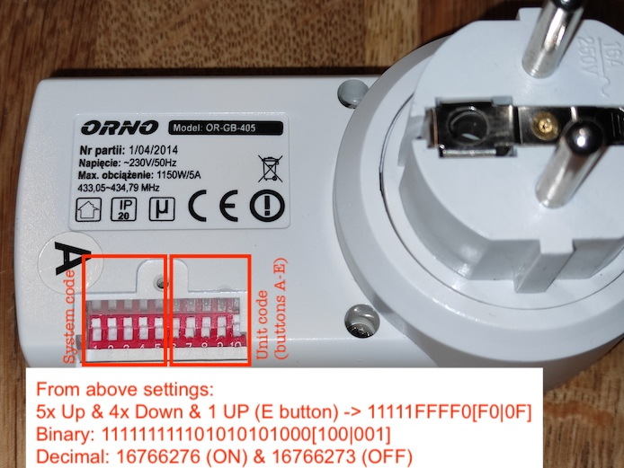

# 433-rc-switch-orno

A repository to provide utils to control Remote Controlled switches made by [ORNO](https://orno.pl/en). It can be useful if you already have such RC switches and you plan to integrate them with Smart Home (Home Assistant etc). Such RC switches are quite popular in Central Europe.

Supported model ORNO model: OR-GB-405 (remote: OR-GB-405PB/W). If you tested it with other models or brands and it works, then please create an issue, I will add it.

Specifications:
- Voltage: ~230V/50Hz
- Max. switching load: 1150W/5A
- Radio band: 433.05-434.79 MHz
- Power consumption: 0.3-0.5W (measured)
- Manual [PDF](https://www.eled.pl/pl/p/file/4d1d66109cf09afb1b31270a3bbf9aee/Instrukcja-obslugi-OR-GB-405.pdf) (in Polish)

## Hardware

- Raspberry Pi Zero, 3, 4, 5 etc (or Arduino)
- Cheap 433MHz transmitter, see [this](https://github.com/sui77/rc-switch/wiki/HowTo_Send) or [this](https://github.com/milaq/rpi-rf) for wiring and transmitter details. Personally, I connected transmitter to 3V from RPi pin (pin 01), instead of 5V (just to be sure that transmitter won't burn)
- Antenna - can be a coil spring or a simple wire (~17cm for the best results i.e. long range). Transmitter might work without it for shorter distances (a couple of meters).

## Software

- Python library: [rpi-rf](https://github.com/milaq/rpi-rf) - preferred way
Or alternatively:
- C++ code from [RPi_utils](https://github.com/ninjablocks/433Utils/tree/master/RPi_utils) - the repository references [rc-switch](https://github.com/sui77/rc-switch/) that is being used on Arduino. However to run on RPi it requires [wiringpi](https://projects.drogon.net/raspberry-pi/wiringpi/download-and-install/) library that sadly for newer Raspberry OS like Bookworm is not officially available

## Code calculator 

Having everything connected, you go open calculator locally by going to `codes-calculator/index.html` on this cloned repo, or by using this [link](https://rawcdn.githack.com/pskowronek/433-rc-switch-orno/main/codes-calculator/index.html) (thanks to githack.com).

The calculator produces copy-paste example for both rpi-rf and 433Utils/RPi_utils.

The Calculator is a very basic HTML with JS - it has been generated by [chatGPT](https://chat.openai.com) v3.5 - this was a test whether chatGPT (LLM) can create a full working html page when provided details of algorithm (see below) etc... and apparently not exactly :) It took me another 2h to explain faults in the generated html/js and finally I've made manual changes to the code. But, the initial html was a good starting point. The whole conversation with chatGPT can be found [here](https://chat.openai.com/share/0981f9a2-b830-441f-970e-718a86f4a9fb). Probably I will re-try exactly the same prompts with chatGPT 4 and others. 

## Troubleshooting

For troubleshooting and ensuring that the transmitter is properly connected and works (yup, it may happen that they are broken), I used [RTL-SDR](https://en.wikipedia.org/wiki/Software-defined_radio#RTL-SDR) (DVB-T USB dongle) along with [CubicSDR](https://github.com/cjcliffe/CubicSDR) to visually verify that signal is transmitted, and also to slightly adjust pulse length.

Under RPi the signal can be distorted due to timing issues related to CPU load of the system. That's why I suggest to increase signal repeat value to 10 or maybe 20.

## Attribution

Big thanks go to the following projects, these were crucial while creating the calculator and could be exposed online for convenience:

- [arduino-UNO-or-Raspberry-PI-RF-433Mhz-ORNO-OR-GB-405](https://github.com/tureq80/arduino-UNO-or-Raspberry-PI-RF-433Mhz-ORNO-OR-GB-405) and its wiki: Good source of how the ORNO signal is encoded and how to decode it

- [rc-switches](https://github.com/lukaszgieraltowski/rc-switches): nice decoding graphs and protocol definition for `rc-switch` ([see here](https://github.com/lukaszgieraltowski/rc-switches/blob/6000257aac41d787f93845f05b68b976ef68314e/src/main.cpp#L40)). Contains also codes for CLARUS BHC993BF-3 RC switches

